> [!WARNING]
> 本仓库因仓库所有者 @Detritalw 而参与 [百日会战计划 #20](https://github.com/BloretCrew/Bloret-Launcher/discussions/20) ，暂时停止维护，约 100 天后解除。  
> 如有问题，请找 @RhedarLiu

  

  <h1 align="center">
  Bloret-Launcher
</h1>

 百络谷 Minecraft 启动器

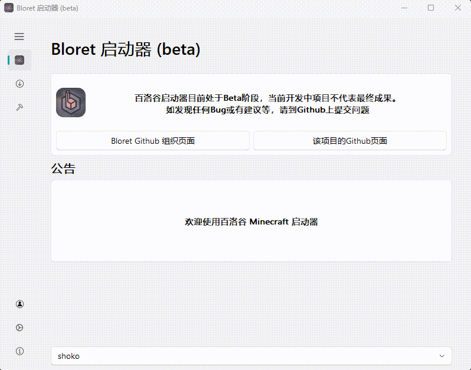

> [!NOTE]
> 您可以以两种方式打开百洛谷启动器
> 1. 下载 `Bloret-Launcher-Windows.zip` ，解压后打开其中的 `Bloret-Launcher.exe`
> 2. 下载软件源代码压缩包 `Source code (zip)` ，解压后在所在目录下运行 `python main.py`
>    （使用步骤二前请先安装 Python ， 运行 `winget install python` 即可）

> [!WARNING]
> 百络谷启动器已证书签名，一般不会被拦截了
> Windows 安全中心可能会拦截此软件，本软件不是任何病毒  
> 百洛谷启动器是开源项目，您可以查阅源代码。  
> 请按照下方操作打开软件
> 

>
> **
单击此处展开，查看操作方法 (2 张图片)
**
>
> 
> 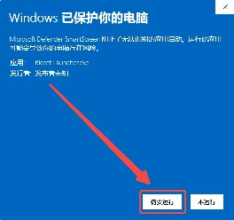
>
> 

## 托开发组要求，特添加此图 👇

  
**
单击此处展开，查看宣传图 (1 张图片)
**
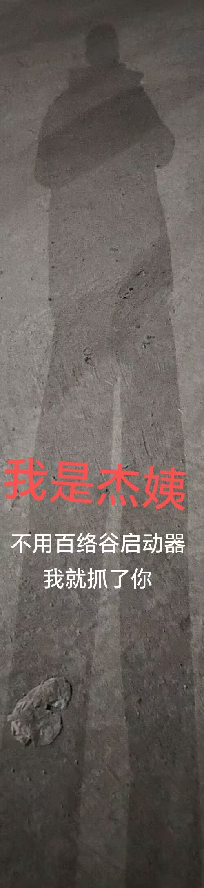

## 功能与计划
- [x] 下载 Minecraft
- [x] 启动 Minecraft
- [x] Minecraft 数据查询
- [x] 日志
- [x] 支持深浅色
- [x] 微软账户登录
- [x] 离线登录
- [ ] 百络谷通行证登录
- [ ] ……

> [!CAUTION]
> 深色模式似乎有点阴间...
> 不建议使用
> 请以浅色模式为主

## 软件截图

**
单击此处展开，查看软件截图 (7 张图片)
**

#### 主界面
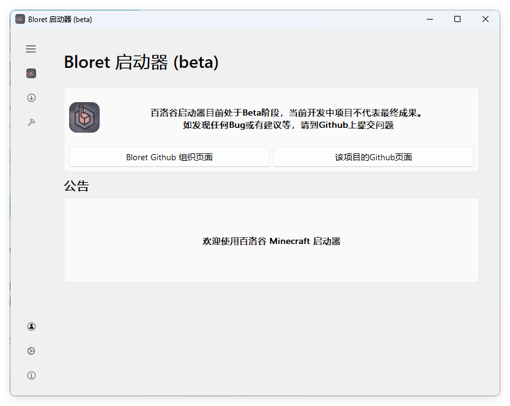
#### 下载
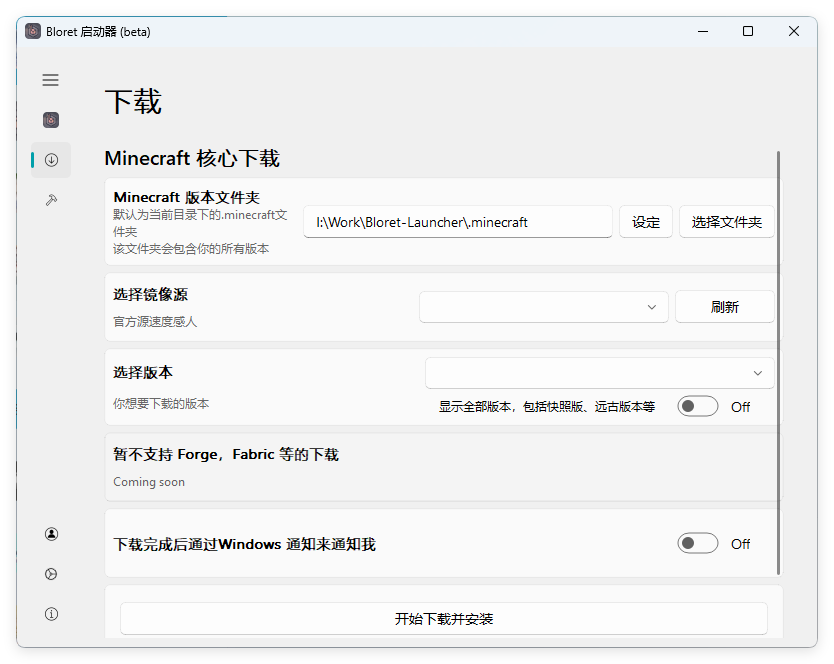
#### 小工具
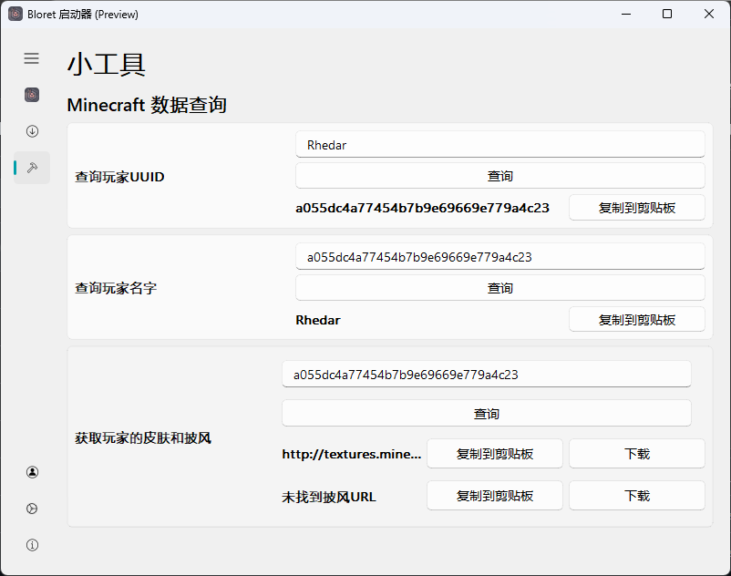
#### 通行证
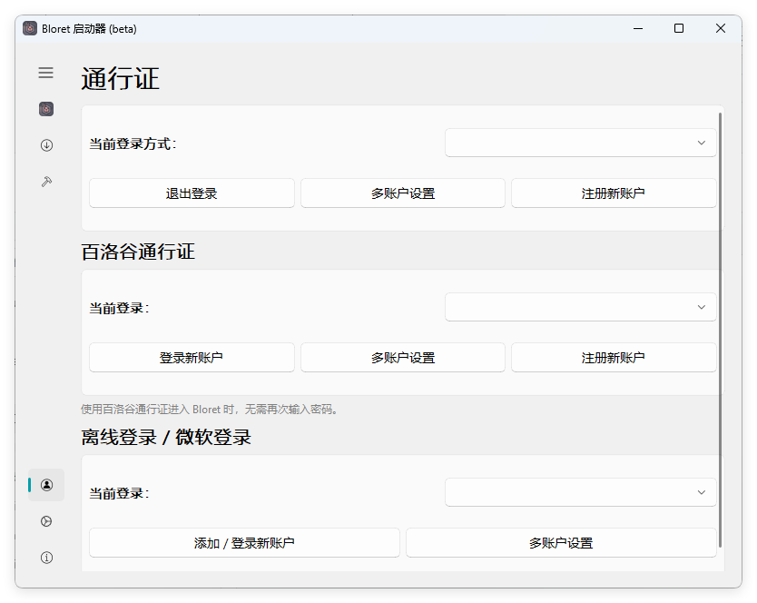
#### 设置
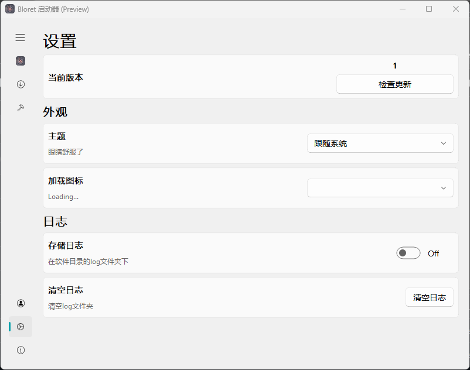
#### 关于
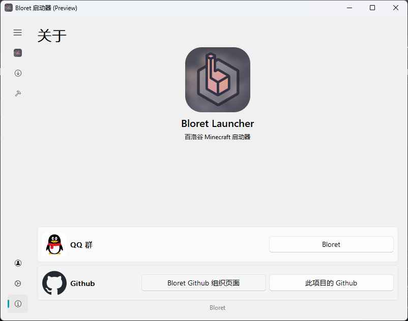
#### 侧边栏
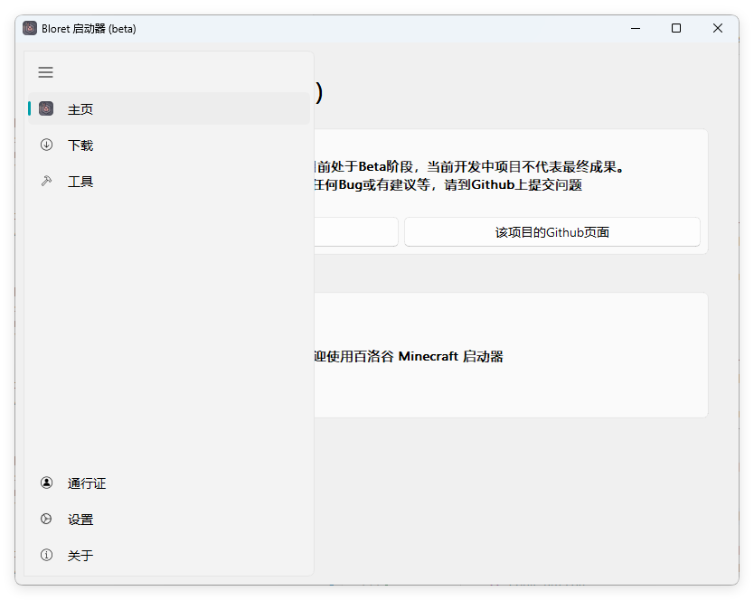

## 安装&使用
到[这里](https://github.com/BloretCrew/Bloret-Launcher/releases)下载最新版本的压缩文件，解压到合适位置后，打开 `Bloret-Launcher.exe` 即可。
## 致谢以下存储库或项目
- [PyQt5](https://www.riverbankcomputing.com/static/Docs/PyQt5/)
- [PyQt Fluent Widgets](https://github.com/zhiyiYo/PyQt-Fluent-Widgets)
- [SF Symbols](https://developer.apple.com/cn/sf-symbols/)

**
[Console Minecraft Launcher](https://github.com/MrShieh-X/console-minecraft-launcher)
**

本项目有一部分基于此项目构建
> 本软件已取得 CMCL 作者许可，请不要像 [不符合 Console Minecraft Launcher (CMCL) 的使用协议 #12](https://github.com/BloretCrew/Bloret-Launcher/issues/12) 一样来问关于 CMCL 的版权问题
> 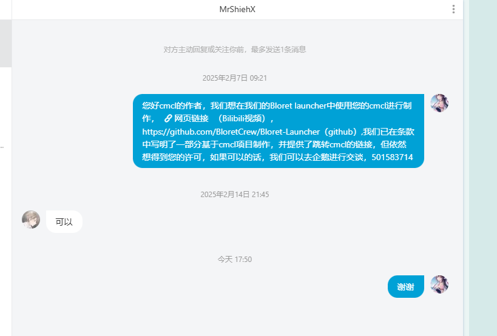

**
[Class Widgets](https://github.com/Class-Widgets)
**
关于为什么会致谢 [Class Widgets](https://github.com/Class-Widgets)：  
[Class Widgets](https://github.com/Class-Widgets) 为 Bloret Launcher 有以下值得我们致谢的点：
 - 为 Bloret Launcher 的 UI 提供了想法
 - Bloret Launcher 已加入 Class Widgets 插件广场
 - @RinLit 为本作品有写法指导
 - [[not cw] 求助为什么崩溃 #392](https://github.com/orgs/Class-Widgets/discussions/392)
 - [求教如何往下拉选择框做东西进去 #338](https://github.com/orgs/Class-Widgets/discussions/338)

## 相关链接
[Bloret QQ 群](https://qm.qq.com/q/clE5KHaVDG)
