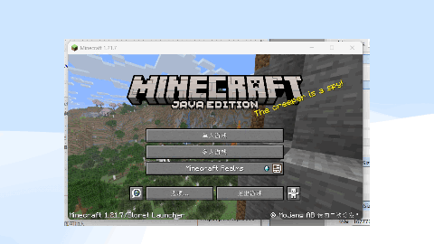

<p align="center">
    
</p>
  <h1 align="center">  
  Bloret Launcher
</h1>
<p align="center">
 Bloret Launcher 不只是 Minecraft 启动器，但也为 Minecraft 玩家提供便捷的游戏启动与管理体验。
</p>

<div align="center">

[](https://github.com/BloretCrew/Bloret-Launcher/actions/workflows/build.yml)
[](https://launcher.bloret.net/go/translate)
[](https://github.com/BloretCrew/Bloret-Launcher/discussions)

  

[](https://github.com/BloretCrew/Bloret-Launcher/releases)


</div>


## 联机使用指南

然后将获取到的端口输入至 Bloret Launcher 中。您将获得一个地址，让您的好友像进入服务器一样加入您的世界。
> [!NOTE]
> 使用 Bloret Launcher 联机，对方无需安装 Bloret Launcher。

> [!NOTE]
> Bloret Launcher 现已加入 [Windows 包管理器 ( Windows Package Manager )](https://github.com/microsoft/winget-cli)
> 因此，现在您可以在终端中输入以下命令快速安装 百络谷启动器
> ```
> winget install Bloret.Launcher
> ```

> [!NOTE]
> 您可以以三种方式打开百洛谷启动器
> 1. 下载 `Bloret-Launcher-Setup.exe` ，运行安装。
> 2. 下载 `Bloret-Launcher-Windows.zip` ，解压后打开其中的 `Bloret-Launcher.exe`
> 3. 下载软件源代码压缩包 `Source code (zip)` ，解压后在所在目录下运行 `python main.py`
>    （使用步骤二前请先安装 Python ， 运行 `winget install python` 即可）

> [!WARNING]
> 百络谷启动器已证书签名，一般不会被拦截了
> Windows 安全中心可能会拦截此软件，本软件不是任何病毒  
> 百洛谷启动器是开源项目，您可以查阅源代码。  
> 请按照下方操作打开软件
> <details>
>
> **<summary>单击此处展开，查看操作方法 (2 张图片)</summary>**
>
> 
> 
>
> </details>

## 托开发组要求，特添加此图 👇
<details>
  
**<summary>单击此处展开，查看宣传图 (1 张图片)</summary>**


</details>

## 功能与计划

- [x] 托盘与托盘菜单
- [x] 自定义启动
- [x] 下载 Minecraft
- [x] 启动 Minecraft
- [x] Minecraft 数据查询
- [x] 日志
- [x] 支持深浅色
- [x] 微软账户登录
- [x] 离线登录
- [x] 百络谷通行证登录
- [x] ……

## 软件截图
<details>

**<summary>单击此处展开，查看软件截图 (7 张图片)</summary>**

#### 主界面

#### 下载

#### 小工具

#### 通行证

#### 设置

#### 关于

#### 侧边栏


</details>

## 致谢以下存储库或项目
- [PyQt5](https://www.riverbankcomputing.com/static/Docs/PyQt5/)
- [PyQt Fluent Widgets](https://github.com/zhiyiYo/PyQt-Fluent-Widgets)
- [SF Symbols](https://developer.apple.com/cn/sf-symbols/)
<details>

**<summary>[Console Minecraft Launcher](https://github.com/MrShieh-X/console-minecraft-launcher)</summary>**

本项目有一部分基于此项目构建
> 本软件已取得 CMCL 作者许可，请不要像 [不符合 Console Minecraft Launcher (CMCL) 的使用协议 #12](https://github.com/BloretCrew/Bloret-Launcher/issues/12) 一样来问关于 CMCL 的版权问题
> 

</details>

<details>

**<summary>[Class Widgets](https://github.com/Class-Widgets)</summary>**
关于为什么会致谢 [Class Widgets](https://github.com/Class-Widgets)：  
[Class Widgets](https://github.com/Class-Widgets) 为 Bloret Launcher 有以下值得我们致谢的点：
 - 为 Bloret Launcher 的 UI 提供了想法
 - Bloret Launcher 已加入 Class Widgets 插件广场
 - [@RinLit](https://github.com/RinLit-233-shiroko) 为本作品有写法指导
 - [[not cw] 求助为什么崩溃 #392](https://github.com/orgs/Class-Widgets/discussions/392)
 - [求教如何往下拉选择框做东西进去 #338](https://github.com/orgs/Class-Widgets/discussions/338)
</details>

## 使用人数统计（实时）

 <picture>
   <source media="(prefers-color-scheme: dark)" srcset="http://pcfs.eno.ink:2/api/BL/madeuserpic" />
   <source media="(prefers-color-scheme: light)" srcset="http://pcfs.eno.ink:2/api/BL/madeuserpic" />
   
 </picture>

## 星标历史

 <picture>
   <source media="(prefers-color-scheme: dark)" srcset="https://api.star-history.com/svg?repos=BloretCrew/Bloret-Launcher&type=Date&theme=dark" />
   <source media="(prefers-color-scheme: light)" srcset="https://api.star-history.com/svg?repos=BloretCrew/Bloret-Launcher&type=Date" />
   
 </picture>

## 相关链接
[Bloret QQ 群](https://qm.qq.com/q/clE5KHaVDG)

